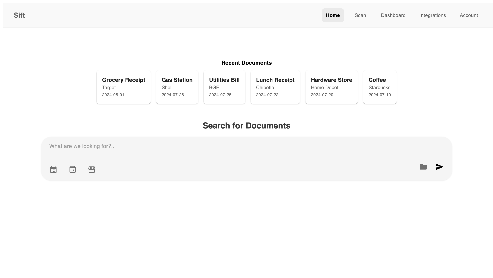

#  Sift – Smart Receipt Scanner

## Project Overview

This project was submitted to the [**2025 AWS Lambda Hackathon**](https://awslambdahackathon.devpost.com/), a global competition hosted by AWS and Devpost focused on building practical, scalable, serverless applications using **[AWS Lambda](https://aws.amazon.com/pm/lambda/?trk=79c0db49-a2f5-438f-a757-26c3de2a4e4f&sc_channel=ps&ef_id=Cj0KCQjwvajDBhCNARIsAEE29WoVVmJuavtdoRBV9trwHDGBZyoEWlCbfF06OIv7U0TzxE7FdCdcQV4aAommEALw_wcB:G:s&s_kwcid=AL!4422!3!651212652666!e!!g!!amazon%20lambda!909122559!45462427876&gad_campaignid=909122559&gbraid=0AAAAADjHtp8GjqpOZuQpUIhkh5NRgUlay&gclid=Cj0KCQjwvajDBhCNARIsAEE29WoVVmJuavtdoRBV9trwHDGBZyoEWlCbfF06OIv7U0TzxE7FdCdcQV4aAommEALw_wcB)** as a core service.

Participants were challenged to solve real-world problems using event-driven architecture and services like [S3](https://aws.amazon.com/s3/), [DynamoDB](https://aws.amazon.com/pm/dynamodb/?trk=350f19ac-2e57-4074-a198-c74012e8c03e&sc_channel=ps&ef_id=Cj0KCQjwvajDBhCNARIsAEE29WpTvK5Kp6IICpsxorbkJUiqPCdla_TOnFJa9gZ0hnaZ3Dgo9ZvjDz8aAjb0EALw_wcB:G:s&s_kwcid=AL!4422!3!610000101513!e!!g!!aws%20dynamodb!11205224796!115505094368&gad_campaignid=11205224796&gbraid=0AAAAADjHtp8uIdzj-kEV0SPdgs7lN6jC0&gclid=Cj0KCQjwvajDBhCNARIsAEE29WpTvK5Kp6IICpsxorbkJUiqPCdla_TOnFJa9gZ0hnaZ3Dgo9ZvjDz8aAjb0EALw_wcB), [Textract](https://aws.amazon.com/textract/), and [API Gateway—all](https://aws.amazon.com/api-gateway/) within a fully serverless infrastructure. Projects were judged on creativity, serverless design, and completeness of implementation.

---

**Sift** is our submission—a full-stack receipt management tool designed to streamline the process of digitizing and organizing physical receipts. With just a photo, Sift automatically extracts metadata (vendor, total, date), categorizes the document, and presents it through a clean, searchable interface.

Built with AWS Lambda, Textract, S3, and DynamoDB, Sift delivers a fast, seamless user experience that removes the manual work of managing receipts—whether for budgeting, taxes, or general organization.


##  Sample Home Page



<center>fig 1. Minimalist dashboard design for viewing and uploading receipts.</center>


## System Architecture

| Layer              | Technology                      |
|--------------------|----------------------------------|
| Frontend           | React + TypeScript + Material UI |
| Backend            | Spring Boot (Java) + REST API    |
| Authentication     | AWS Cognito (JWT-based login)    |
| File Storage       | Amazon S3                        |
| Text Extraction    | Textract via Lambda              |
| Metadata Storage   | DynamoDB                         |
| Monitoring         | CloudWatch                       |
| Deployment         | Docker + GitHub Actions          |

---

##  Core Features

- Upload or capture receipts directly from the web UI  
- Automatic metadata extraction triggered via S3 uploads  
- OCR-based parsing (vendor, total, date, items) with editable review screen  
- Searchable archive with filters by vendor or date  
- Summary dashboard for tracking recent spending (coming soon)  
- Authenticated user sessions with [AWS Cognito](https://aws.amazon.com/pm/cognito/?trk=d301d281-9b20-42d3-b169-acc0c54e9ac2&sc_channel=ps&ef_id=Cj0KCQjwvajDBhCNARIsAEE29Wo7hdOv8hTqPy2elENNlyflnZht9D-keU6omheMu0to8hYz2v9Ru_gaAnXREALw_wcB:G:s&s_kwcid=AL!4422!3!651737511575!e!!g!!amazon%20cognito!19845796024!146736269189&gad_campaignid=19845796024&gbraid=0AAAAADjHtp897ffQJUUzoIZVtzG4P1qyB&gclid=Cj0KCQjwvajDBhCNARIsAEE29Wo7hdOv8hTqPy2elENNlyflnZht9D-keU6omheMu0to8hYz2v9Ru_gaAnXREALw_wcB) + JWT tokens  


##  Install + Setup

```bash
git clone https://github.com/danielcoblentz/sift.git
cd sift
cd my-frontend
npm install
npm run dev
```
### Create an .env file and add:
```
VITE_API_BASE_URL=http://localhost:8080
VITE_COGNITO_CLIENT_ID=yourClientId
VITE_COGNITO_REGION=yourRegion
```
### Backend
```

cd ../backend
./mvnw spring-boot:run
```

### Lambda
Deploy lambda/textractHandler.py using AWS Console or the SAM CLI
Set an S3 bucket trigger for new uploads
Attach IAM permissions for S3, Textract, and CloudWatch.


## Acknowlagements:
Sift was created as part of the 2025 AWS Lambda Hackathon, with the goal of solving real-world problems through serverless cloud infrastructure. Special thanks to the AWS team, mentors, and Devpost community for their support and feedback throughout the event.